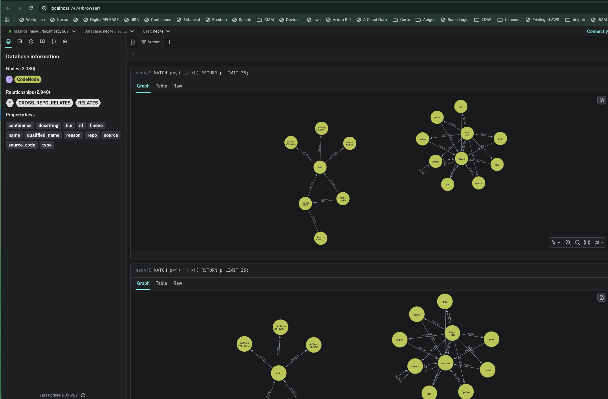
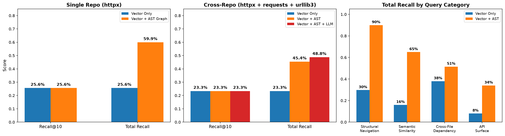
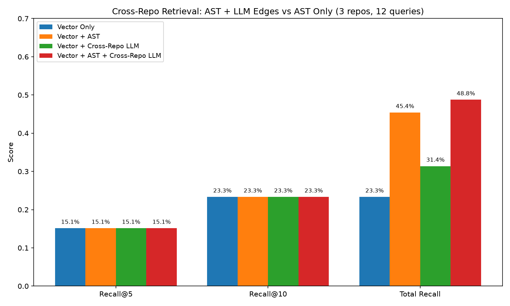
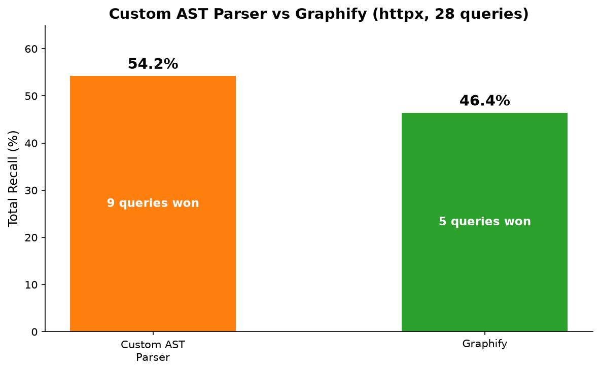
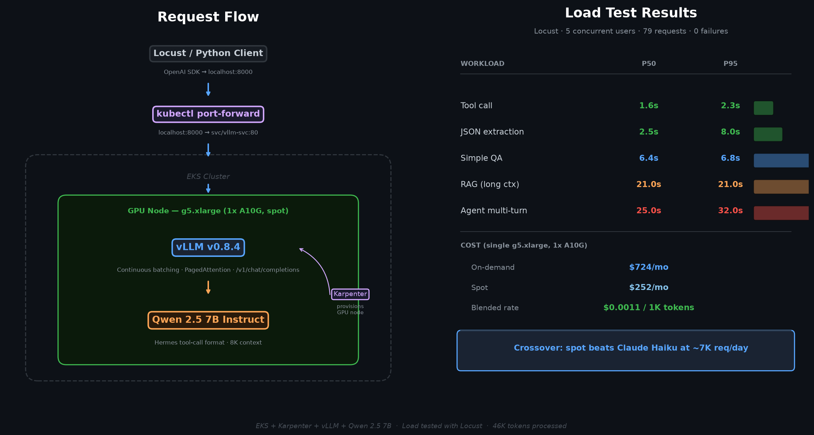
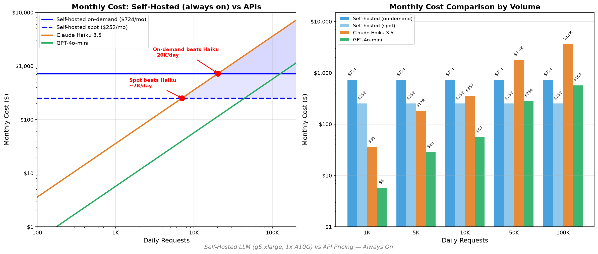

# GraphRAG POC — Code Retrieval with Knowledge Graphs

A proof-of-concept AI platform that combines vector search with graph-based code retrieval, served via a self-hosted LLM on EKS.

## What This Does

Traditional RAG retrieves code by semantic similarity — but misses structural relationships like inheritance, function calls, and cross-file dependencies. This project builds a **GraphRAG** system that:

1. **Parses** Python codebases (httpx, requests, urllib3) into an AST-based knowledge graph (Neo4j)
2. **Embeds** code symbols into a vector store (ChromaDB + BGE embeddings)
3. **Retrieves** using hybrid search: vector finds entry points, graph expansion walks structural edges (CALLS, INHERITS, IMPORTS) to discover related symbols
4. **Reasons** via a LangGraph agent with tool-calling capabilities

## Knowledge Graph



## Key Results



### Experiment 1: Single-Repo GraphRAG (httpx, 28 queries)

- AST graph expansion **more than doubles total recall** (22.9% → 54.2%) — finds symbols embeddings miss entirely
- Graph is a **recall expander, not a ranker**: Recall@10 and NDCG@10 are identical with or without graph — graph-discovered symbols always rank below vector hits
- Why? Graph finds structurally important but semantically distant symbols. `_build_auth()` doesn't score high against "how does authentication work?" even though it's the method that wires auth in. Boosting graph scores would push irrelevant neighbors above relevant vector hits. The fix is a re-ranker or agent downstream that can consume 20-30 candidates
- Within-repo LLM edges (500 calls, 478 SIMILAR_TO/DEPENDS_ON edges) added **zero recall** — the AST parser already captured all the signal. CALLS and INHERITS encode architecture; LLM edges just rediscovered what the import graph already knew

### Experiment 2: Cross-Repo GraphRAG (httpx + requests + urllib3, 12 queries)



- AST edges can't cross repo boundaries — there's no IMPORT from `httpx.BasicAuth` to `requests.HTTPBasicAuth`
- **Pair selection:** 2,080 nodes = 4.3M possible pairs. Brute-forcing LLM calls is impractical. Instead: embed all symbols, compute cosine similarity across repos only (skip same-repo), take the top 500 pairs, LLM-validate each. 500 calls, not 4.3M
- Result: 538 cross-repo edges. AST alone: 45.4% total recall → AST + cross-repo LLM: **48.8%** (+3.4pp)
- Cross-repo LLM edges alone (without AST) scored only 31.4% — worse than AST alone. LLM edges complement AST, they don't replace it
- LLM edges found symbols AST couldn't: `urllib3/GzipDecoder` → `httpx/GZipDecoder`, `urllib3/encode_multipart_formdata` → `httpx/MultipartStream` — structurally invisible but semantically equivalent

### Experiment 3: Custom AST Parser vs Graphify



Compared against [Graphify](https://github.com/Graphify-Labs/graphify), an open-source tree-sitter code graph tool:

- Graphify found 2.7x more edges (3,613 vs 1,328) with finer-grained types (`references`, `indirect_call`, `method`)
- Both parsers extract methods but name them differently (`BasicAuth.__init__` vs `.__init__()`). After fixing the mapping (89% match rate, 1,057 edges connected):

| | Custom AST | Graphify |
|---|---|---|
| **Total recall** | **54.2%** | 46.4% |
| **Queries won** | **9** | 5 |

- Graphify won on redirect handling (+80%) and async client (+40%). Custom parser won on URL parsing, utilities, status codes
- Key trade-off: Graphify gives ~40 languages, community detection, visualization out of the box. Custom parser gives stable global IDs for cross-repo edges, Neo4j as queryable backend, full schema control

### Self-Hosted LLM Load Test



**LLM Serving Architecture:**

```
              ┌─────────────────────┐
              │   Application Layer  │
              │  (Agent, Extractor,  │
              │    Eval, Locust)     │
              └─────────┬───────────┘
                        │ OpenAI-compatible API
                        ▼
              ┌─────────────────────┐
              │   LiteLLM Gateway   │
              │  (model router)     │
              └──┬──────┬──────┬────┘
                 │      │      │
            ┌────▼──┐ ┌─▼──────┐ ┌──▼──────┐
            │ vLLM  │ │  vLLM  │ │  vLLM   │
            │(Qwen) │ │(Mistr.)│ │  (...)  │
            └───┬───┘ └───┬────┘ └───┬─────┘
                │         │          │
            ┌───▼───┐ ┌───▼────┐ ┌───▼─────┐
            │ A10G  │ │ A10G   │ │  A10G   │
            └───┬───┘ └───┬────┘ └───┬─────┘
                └─────────┼──────────┘
                          │
              ┌───────────▼─────────────┐
              │ Karpenter (spot, scale  │
              │ to-zero / scale-out)    │
              └───────────┬─────────────┘
                          │
              ┌───────────▼─────────────┐
              │       EKS Cluster       │
              └─────────────────────────┘
```

Tested with Locust against Qwen 2.5 7B on vLLM (g5.xlarge):

| Workload | P50 | P95 |
|---|---|---|
| Tool call | 1.6s | 2.3s |
| JSON extraction | 2.5s | 8.0s |
| Simple QA | 6.4s | 6.8s |
| RAG (long context) | 21s | 21s |
| Agent multi-turn | 25s | 32s |

**Cost:** $724/mo on-demand, $252/mo spot — beats Claude Haiku API above ~7K daily requests (spot).



### Takeaway

- **Within a repo:** AST wins. Free, fast, deterministic. LLM edges are expensive noise
- **Across repos:** LLM is the only option. Embedding-pruned pair selection keeps costs tractable. But LLM edges alone aren't enough — they complement AST, not replace it
- **Build vs buy:** Graphify for prototyping; own the parser if you need cross-repo identity or a queryable graph backend
- **Production architecture:** AST graph per repo (batch, cheap), cross-repo LLM edges on a schedule (incremental), vector search as entry point, re-ranker downstream

## Project Structure

```
├── agent/              # LangGraph agent with tool-calling
├── ingestion/          # AST parser, embedder, Neo4j loader, LLM extractor
├── retrieval/          # Hybrid search (vector + graph), Cypher templates
├── eval/               # Golden datasets (single + cross-repo), metrics (NDCG, MRR, P@K)
├── loadtest/           # Locust load tests, cost analysis, reports
├── infra/
│   ├── eks/            # EKS cluster config (eksctl)
│   ├── karpenter/      # GPU NodePool + EC2NodeClass
│   └── k8s/            # vLLM deployment, service, secrets
└── docs/               # LinkedIn posts
```

## Stack

- **LLM Serving:** vLLM on EKS with Karpenter GPU autoscaling (spot instances)
- **Model:** Qwen 2.5 7B Instruct (Hermes tool-call format)
- **Graph DB:** Neo4j (AST-based code knowledge graph)
- **Vector DB:** ChromaDB with BGE-small-en-v1.5 embeddings
- **Agent:** LangGraph with OpenAI-compatible tool calling
- **Load Testing:** Locust with 5 realistic workload categories
- **Infra:** EKS, Karpenter, kubectl port-forward

## Setup

```bash
# Install dependencies
pip install -r requirements.txt  # or: pip install openai langchain-openai chromadb neo4j

# Set environment variables
export NEO4J_PASSWORD=your_password
export LLM_BASE_URL=http://localhost:8000/v1
export LLM_API_KEY=your_key

# Run the agent
python -m agent.run "How does httpx handle authentication?"
```

## Related Posts

- [Self-Hosted LLM on EKS — Cost & Latency Analysis](docs/linkedin-post-vllm-eks.md)
- [GraphRAG: When Vector Search Isn't Enough](docs/linkedin-post-graphrag.md)
- [Custom AST Parser vs Graphify](docs/linkedin-post-graphify.md)
