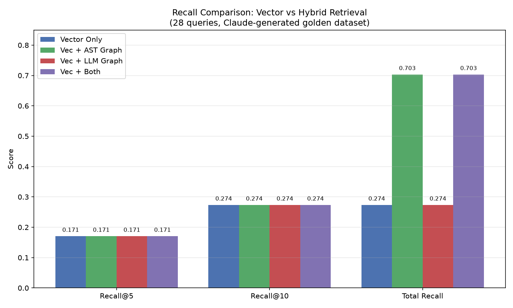
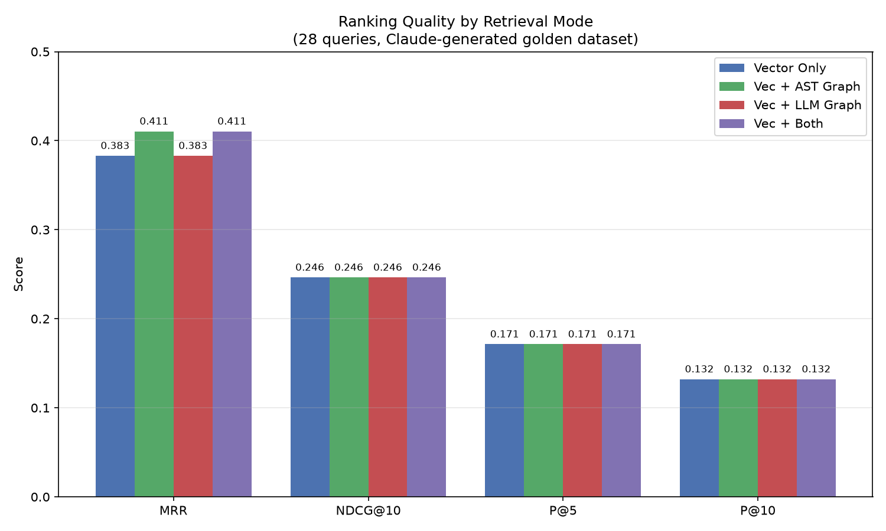
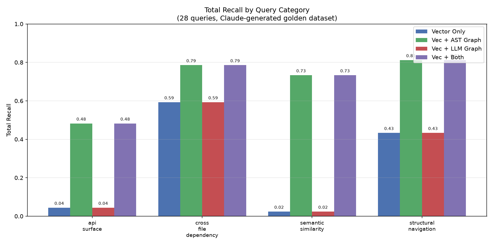

# LinkedIn Post — GraphRAG: When Vector Search Isn't Enough

RAG doesn't work well on code. Here's why, and what I built instead.

The failure mode is subtle. You ask "how does httpx handle authentication?" Vector search returns `BasicAuth`, `DigestAuth`, `NetRCAuth` — semantically similar to your query. Looks good. But it completely misses the `Auth` base class they inherit from, the `Client._build_auth()` that wires them in, and the `_auth_flow` generator that orchestrates the challenge-response cycle. Those are structurally connected, not semantically similar. Embeddings can't see inheritance hierarchies or call graphs.

**The fix: use the structure that's already there.**

Code isn't a document. It has a formal, parseable structure — an AST. Every class, function, and method is a node. Every CALL, IMPORT, INHERIT is an edge. This graph already exists in the source code. You just have to extract it.

So I built a GraphRAG system: vector search finds the entry points, then graph expansion walks structural edges to pull in related symbols the embeddings missed. Hop-decay scoring (0.8 per hop) keeps distant neighbors from diluting relevance.

**The results that changed my assumptions:**

AST graph expansion **more than doubled total recall** — from 27.4% to 70.3%. But it didn't improve top-k ranking. Recall@5, Recall@10, NDCG@10 were identical with or without the graph. Here's what that means:

1. **Graph is a pure recall expander, not a ranker.** It finds relevant symbols that embeddings miss entirely — but those symbols rank below the vector hits. The graph fills in the long tail, not the top of the list. This matters: if your application only looks at top-10 results, graph adds nothing. If it can use 20-30 results (like an agent with tool calls), graph is a 2.6x recall win.

2. **LLM-extracted edges added zero value.** I spent tokens having an LLM classify SIMILAR_TO / DEPENDS_ON relationships between symbols. The AST edges (CALLS, INHERITS, IMPORTS) already captured the useful structure. Zero graph nodes came from LLM edges. The parser gives you the graph for free.

3. **Graph without vector is useless.** Pure graph traversal without good seed nodes returns noise. The vector search IS the entry point — you need both, but in a specific order.

4. **The real win is cross-file discovery.** Authentication in httpx spans `_auth.py`, `_client.py`, and `_config.py`. Vector search finds one file. The graph finds all three. This is the problem GraphRAG actually solves for code: following dependencies across file boundaries.

**The uncomfortable conclusion:**

For code, the knowledge graph you need is the one your parser already gives you for free. The expensive LLM extraction step that papers recommend? I ran a controlled eval and it didn't move the needle. CALLS and INHERITS edges did all the work.

This doesn't mean LLM-extracted edges are useless for all domains — unstructured documents don't have ASTs. But if your corpus has formal structure (code, schemas, APIs, configs), extract the graph from the structure first. Only add LLM edges if the eval shows a gap.

Stack: Python, Neo4j, ChromaDB, LangGraph agent, BGE embeddings. Code on GitHub.

---

#GraphRAG #RAG #KnowledgeGraph #Neo4j #CodeSearch #InformationRetrieval #AIEngineering #GenAI #NLP
